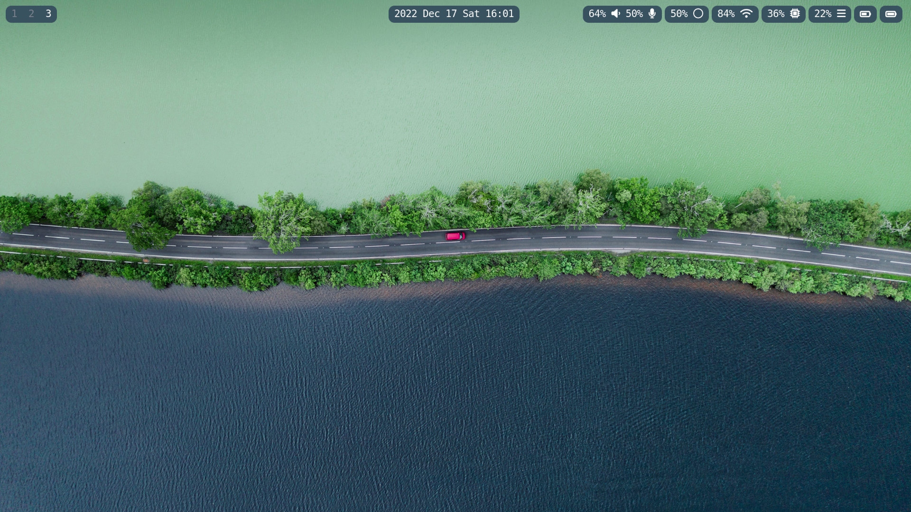
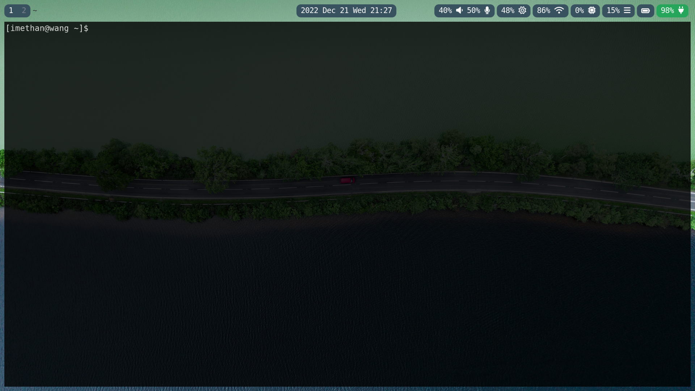
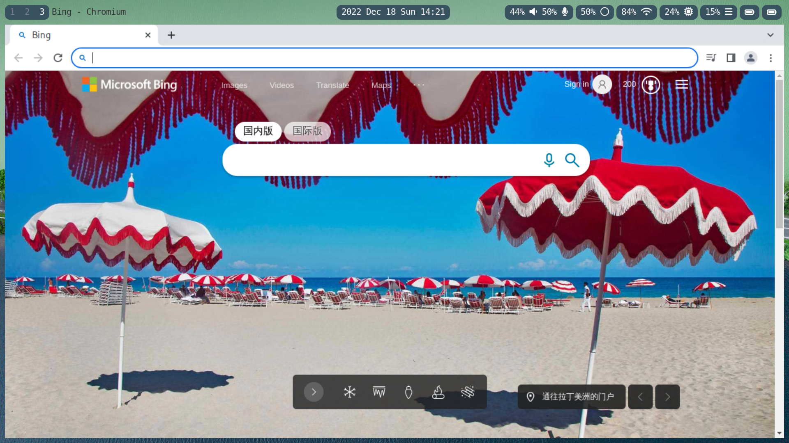
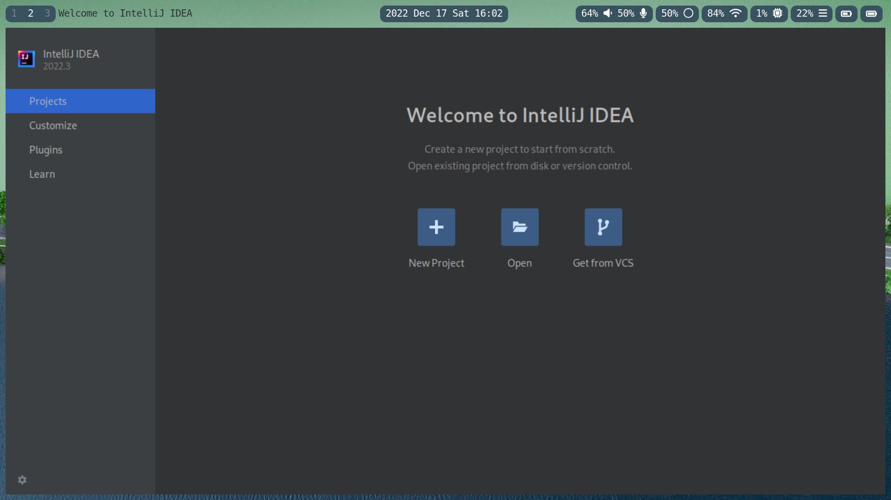

# Ethan's Sway config

This repository is my Linux Desktop (Arch Linux + Sway) configuration set in my laptop. 
I have used it in a while, and now it can meet my most daily needs.

### Installed applications or tools

* Sway - using Vulkan as graphic render
* Waybar - replace Swaybar, the latter's customization is weak 
* Swaylock - screen lock tool
* Swayidle - idle management tool
* Swaybg - Sway's background tool
* Wofi - application launcher
* Kitty - terminal simulator
* Pulseaudio - audio management tool
* Fcitx5 - inputting tool
* Fcitx5-rime - Chinese inputting engine
* WireGuard - VPN tool
* Chromium - browser
* Intellij IDEA - Java and other programming language's IDE
* Grim - screen shot tool

These are some screen shoot in my PC:

### Next step

I will continue to explore the Linux world, it has given me much surprise and frustration. 
I like Linux cause it will not make me feel boring. 

I will update my desktop setting and share it in this repo, 
and I am willing to receive the suggestion about existed or missing feature. 
If you found any issue about these configuration in your computer, please kindly to point it out.